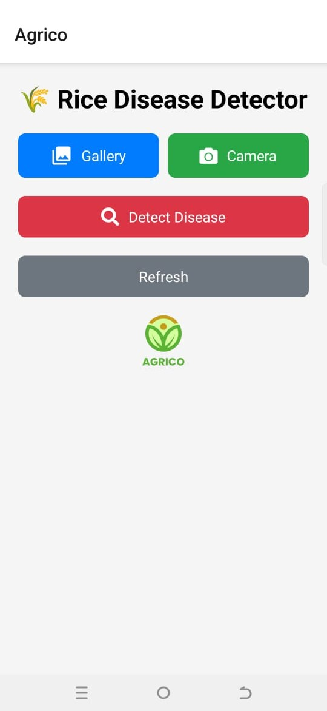
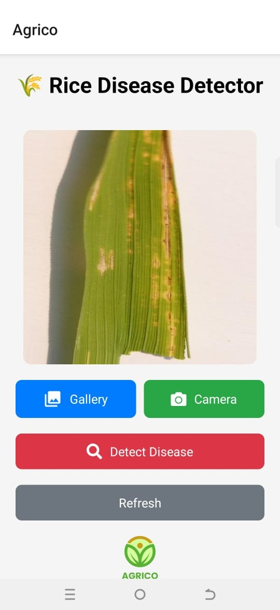
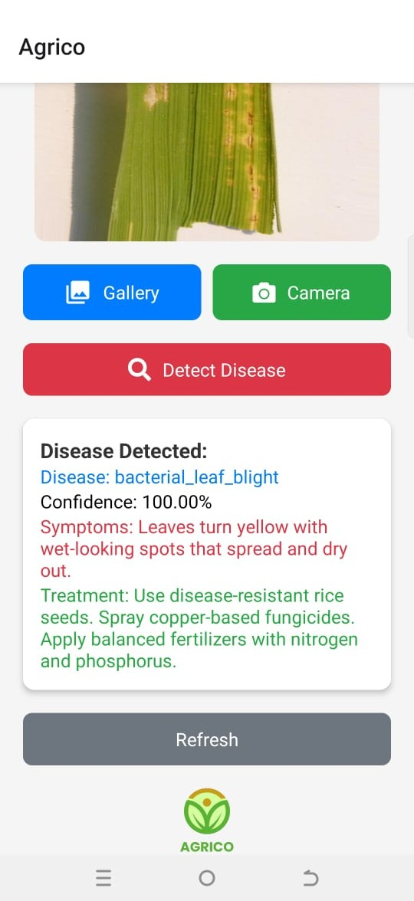

###  Agrico - Mobile App

Agrico is a React Native mobile application designed to detect rice crop diseases using deep learning. The app allows users to upload or capture an image of a rice leaf, which is then analyzed by a backend model to diagnose potential diseases. This empowers farmers and agricultural experts with early detection and treatment suggestions, ultimately contributing to healthier crop yields.


###  Features

- **Image Upload:** Pick an image from the gallery or capture one using the camera.
- **AI-Powered Detection:** Sends the image to a deep learning model for disease analysis.
- **Instant Results:** Displays detected disease, confidence score, symptoms, and treatment recommendations.
- **User-Friendly UI:** Simple and intuitive interface with interactive buttons and real-time feedback.
- **Error Handling:** Displays messages for network errors, permission issues, and invalid images.
- **Refresh Option:** Allows users to reset and upload a new image for diagnosis.


###  Screenshots


### Home Screen


### Image Upload


### Detection Result



###  Tech Stack

- **Frontend:** React Native, Expo
- **Icons:** React Native Vector Icons (MaterialIcons, FontAwesome5)
- **Backend:** FastAPI
- **AI Model:** CNN Deep learning model trained for rice disease classification


###  Installation & Setup

###  Clone the Repository
```bash
 git clone https://github.com/Shahzad-Ali-44/Agrico-app.git
 cd Agrico-app
```

###  Install Dependencies
```bash
npm install
```

###  Run the App
```bash
npx expo start
```
Then scan the QR code with Expo Go (Android/iOS) to run the app on your device.


###  How It Works
1. Open the Agrico app.
2. Grant camera and gallery permissions when prompted.
3. Upload an image from the gallery or capture one using the camera.
4. Click the **"Detect Disease"** button.
5. The app will send the image to the backend for analysis.
6. The detected disease, confidence score, symptoms, and treatment will be displayed.
7. Click **"Refresh"** to analyze a new image.


###   API Endpoint
Agrico sends the image to the following API endpoint:
```
https://ShahzadAli44-Agrico-backend.hf.space/predict
```

The API returns a JSON response with:
- `class`: Detected disease
- `confidence`: Model confidence score
- `symptoms`: Identified symptoms
- `treatment`: Recommended treatment


###   Permissions Required
- **Camera Access:** To capture real-time images.
- **Gallery Access:** To pick images from the device.


###  Future Enhancements
-  Support for additional crops
-  Disease history tracking
-  Geo-tagging for location-based insights
-  Notifications for treatment reminders


###  Contributing
Contributions are welcome! Feel free to fork the repository and submit a pull request.


###  License

This project is licensed under the [MIT License](LICENSE).


*🌾 Agrico - Empowering Farmers with AI Technology.*
